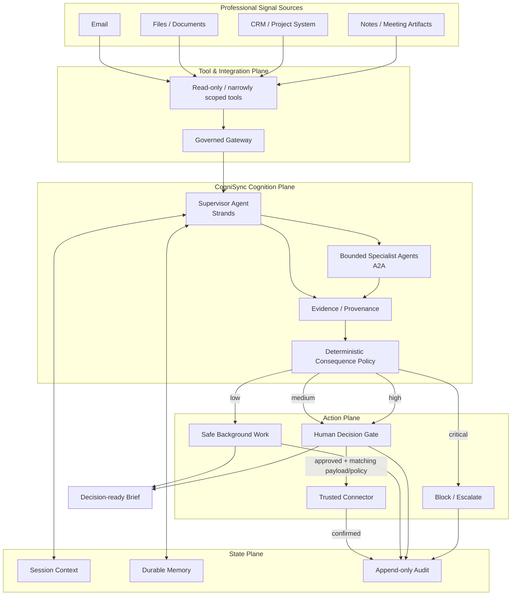

# CogniSync Professional — Architecture Specification

## 1. Design objective

CogniSync is a background-first professional agent. Its architecture separates **cognitive work** from **consequential execution**.

### Core invariant

> The agent may inspect, classify, summarize and prepare autonomously. It may not silently create externally consequential side effects.

The principal state invariant is:

`prepared ≠ authorized ≠ executed`

## 2. Runtime topology

The **capability firewall** is the architectural boundary between model reasoning and consequential tools: model output can propose an action, but only deterministic policy can classify its consequence, and only an explicit human decision can authorize high/critical execution.

## 3. Separation of concerns

CogniSync treats three questions independently:

1. **What is known?** — evidence, source records and context.
2. **What should happen?** — agent reasoning and planning.
3. **Is it authorized now?** — explicit consequence policy.

This prevents a correct model inference from being treated as automatic authorization.

## 4. Strands layer

Strands is the orchestration layer. It owns the agent loop, model interaction and tool use. The deterministic safety policy remains outside the model so changing models does not silently change authorization rules.

The live adapter is intentionally narrow in `cognisync.agent`. Its included signal-inspection tool is deterministic and read-only: it performs no writes, sends, publishes, record changes or external service calls. Consequential connectors remain behind the capability firewall.

## 5. Memory layer

The production design uses:

- session context for the active workflow;
- durable memory for compacted semantic state, stable preferences and recurring project facts.

Memory can improve continuity but does not grant authority. Important consequential operations retain current-run evidence and authorization context.

## 6. MCP / Gateway layer

The gateway is treated as the integration perimeter for professional systems. Tool surfaces should be narrow, authenticated and governed. Provider-specific credentials remain at the connector boundary rather than entering prompts or model context.

Remote resource identifiers should be constrained to trusted schemes and patterns to reduce SSRF and local-resource exposure risks.

## 7. A2A specialist layer

A2A is used only when bounded specialization creates measurable value. Example workers include classification, document structure extraction, reporting and quality review.

The supervisor delegates narrow tasks, preserves evidence continuity and remains responsible for final policy evaluation. An unconstrained agent swarm is not an architectural goal.

## 8. Safety policy

| Risk | Examples | Default |
|---|---|---|
| Low | read, classify, summarize, draft | autonomous |
| Medium | reversible internal preparation | policy-dependent |
| High | send, publish, modify records, payment | approval |
| Critical | unknown, destructive, privilege escalation | block + explicit decision |

The local implementation lives in `cognisync/policy.py` and is tested independently. Each gated decision records a stable policy fingerprint so an authorization cannot silently cross a changed policy boundary.

## 9. Audit and provenance

Meaningful workflow transitions generate machine-readable audit events. The local event chain is hash-chained for tamper detection.

The conceptual correlation path is:

`run → analysis → evidence → policy(hash) → decision(payload hash) → connector outcome`

The decision layer binds human approval to the exact proposed payload and the policy fingerprint active when the decision was created. Production telemetry should preserve a stable run/correlation identifier across distributed components.

## 10. Execution and failure semantics

The design explicitly handles:

- empty input — remain idle rather than fabricate work;
- unknown action — classify as critical;
- missing evidence — reject candidate promotion;
- tool timeout — retry only where operation semantics and policy permit;
- malformed tool result — do not report completion;
- ambiguous external outcome — remain non-success until trusted confirmation;
- prompt injection — treat external content as untrusted data, never authority;
- decision replay — reject reuse of a resolved decision;
- payload substitution — reject execution when the approved payload fingerprint no longer matches;
- policy drift — reject execution when the decision's policy fingerprint differs from the active policy.

The production system must model execution as:

`prepared → decision_pending → approved/rejected → connector_confirmed`

No local simulation, model statement or request dispatch is sufficient to establish `connector_confirmed`.

## 11. Deployment progression

### Stage A — local judgeable prototype

No cloud credentials required. Run tests and deterministic demos.

### Stage B — model-backed agent

Install the AWS integration extra and configure a validated model/runtime environment.

### Stage C — hosted execution

Deploy the agent to the chosen hosted runtime only after validating current SDKs, IAM, networking, secrets and observability in the target environment.

### Stage D — real MCP integrations

Connect narrowly scoped professional systems through a governed tool boundary with explicit authorization and connector confirmation.

### Stage E — bounded A2A specialization

Introduce remote specialist agents only where benchmarks demonstrate measurable quality, latency, cost or reliability benefit.

### Stage F — continuous evaluation

Run regression, adversarial and fault-injection evaluation on each meaningful change.

## 12. Architecture acceptance rule

A production architecture claim is accepted only when the corresponding integration is validated in the target environment. Repository code, dependency presence or a diagram is not treated as proof of deployment.
